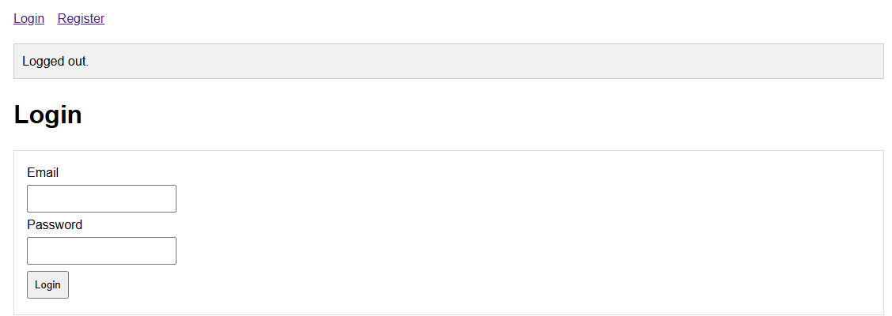
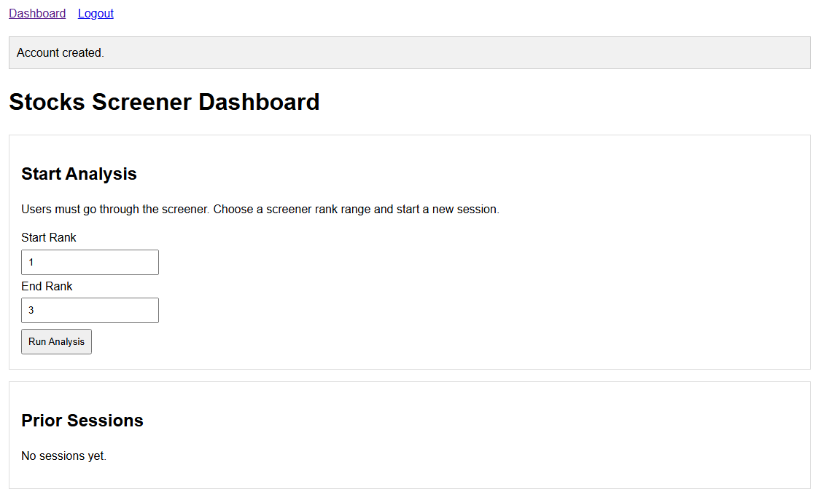
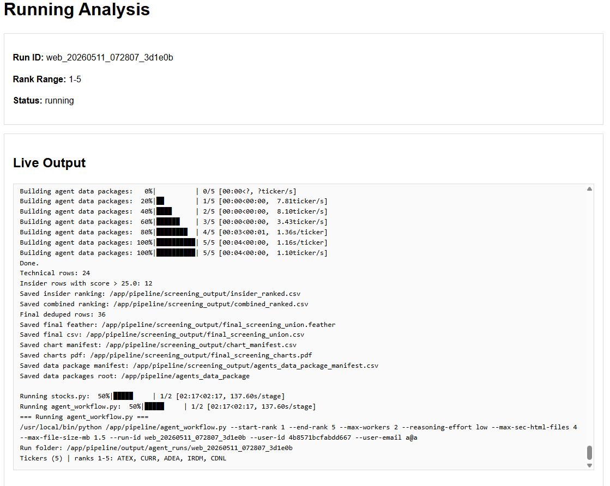
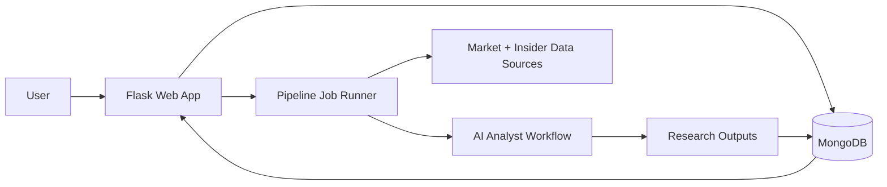

# Stock Research Platform


An end-to-end equity research platform that combines quantitative screening, insider-trading signals, and AI-generated analysis in a production-style web workflow.

## Live Demo + Screenshots

- Live app: http://204.48.16.73:5001
- Repository: https://github.com/hitaanshjain/StockAnalyzer





## Why This Matters

Retail investors often see momentum moves but do not have a reliable way to quickly separate hype from signal. This project helps users move from raw market noise to structured decision support by combining price action, insider activity, and explainable AI-generated research summaries.

Primary users:

- Individual investors who want a faster first-pass research workflow.
- Data-oriented users who want reproducible screening logic before deeper due diligence.

## What I Built

I implemented a three-service system that turns market data into an interactive analysis experience:

- A Flask web app with authentication, job submission, live run logs, and persisted result views.
- A screening pipeline that builds a U.S. stock universe, ranks candidates, and assembles research packages.
- A Mongo-backed persistence layer and import tooling for pipeline output and web consumption.

## My Contributions

This repository was built as a team project, and my portfolio focus is on the parts I directly owned and integrated:

- Built core web app features in Flask, including auth flow, dashboard interactions, job launch UX, and result rendering.
- Designed and integrated MongoDB data models/collections to persist screening runs, analysis jobs, and result payloads.
- Implemented web-to-MongoDB data flow so user-triggered jobs are stored reliably and surfaced in the dashboard.

## Architecture Diagram + Data Flow



Data flow summary:

1. User starts a screening/analysis job from the web dashboard.
2. Pipeline collects market and insider data, computes rankings, and builds research packages.
3. AI analyst stage generates structured writeups from package inputs.
4. Outputs are persisted in MongoDB and surfaced back in the web UI.

## Key Technical Challenges and Tradeoffs

- Data source reliability vs coverage: External APIs and public endpoints can be noisy; the system favors retryable workflows and reruns over brittle hard-fail behavior.
- Throughput vs freshness: End-to-end analysis can be compute/network heavy, so the pipeline prioritizes deterministic batch runs over real-time tick updates.
- Explainability vs model depth: AI summaries are structured and readable for decision support, while final investment decisions still require manual validation.

## Reliability and Performance Notes

- Automated tests cover service-level behavior for web, pipeline, and Mongo modules.
- CI pipelines run reliability gates on every push/PR to catch regressions early.
- Service-specific Docker images are built and published, enabling reproducible deployments.
- Web deployment is automated so validated changes can be promoted with confidence.

Run tests locally:

```bash
pip install pytest pytest-cov
pytest mongo_service/tests pipeline/tests web/tests --cov=. --cov-report=term-missing
```

## Future Improvements

- Add asynchronous job queueing (Celery/RQ) to support concurrent analysis requests.
- Expand explainability with factor-level attribution and confidence scoring.
- Add historical backtesting and paper-trading style validation for strategy drift checks.
- Introduce role-based access controls and audit trails for multi-user production usage.

## Quickstart

Prerequisites: Docker Desktop (or Docker Engine + Compose).

1. Clone the repository.

```bash
git clone https://github.com/hitaanshjain/StockAnalyzer.git
cd StockAnalyzer
```

2. Create environment file.

```bash
cp .env.example .env
```

3. Add required variables to `.env`:

```bash
OPENAI_API_KEY=your_openai_api_key_here
SEC_USER_AGENT=Your Name your_email@example.com
MONGODB_URI=mongodb://mongodb:27017
MONGODB_DB_NAME=stocks_app
FLASK_SECRET_KEY=your_random_secret_here
```

4. Build and start services.

```bash
docker compose up --build
```

5. Open the app.

- http://localhost:5001

Optional pipeline and import runs:

```bash
docker compose --profile pipeline run pipeline
docker compose --profile seed up mongo_seed
```

Stop services:

```bash
docker compose down
```

## Repository Layout

```
.
├── web/                  # Flask web application
├── pipeline/             # Stock screener and AI analyst
├── mongo_service/        # MongoDB helpers and seed tooling
├── docker-compose.yml    # Orchestrates all services
├── .env.example          # Environment variable template
└── README.md
```
